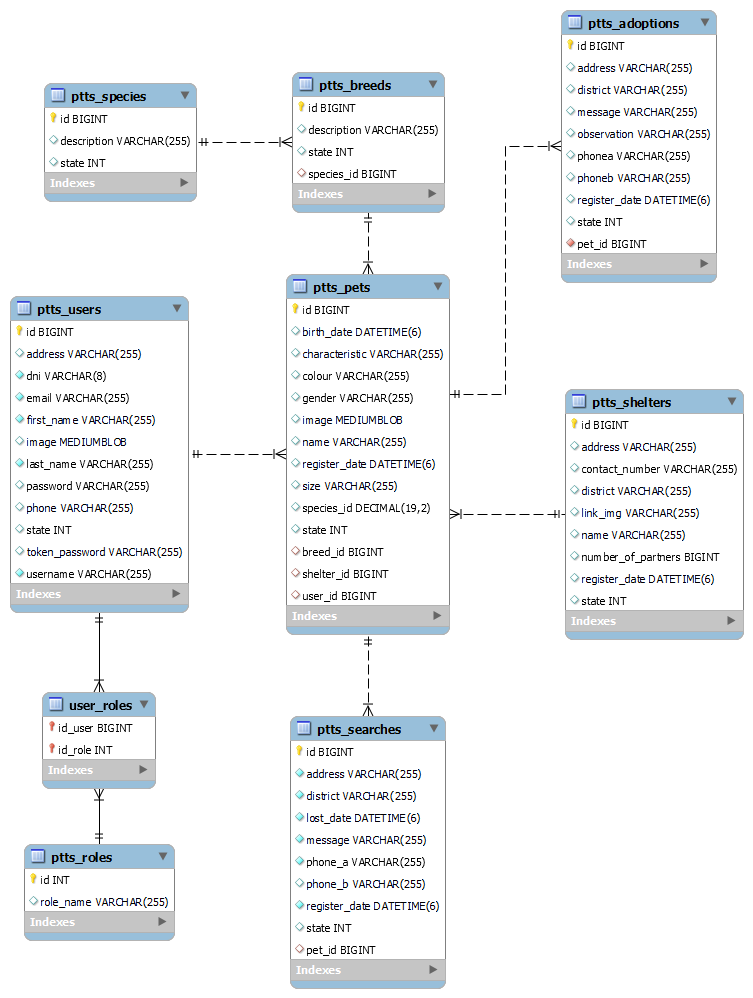

# Spring Lost Pets Backend

Backend for the Lost Pet project

## Deployment

* [Project Deploy Swagger](https://spring-mascotas-backend-production.up.railway.app/swagger-ui/index.html#/)


## Description

Spring Boot version > 2.6.X is used

## Start

### Dependencies

* Spring v2.6.2, Spring JPA, MySQL driver, Java 8+.
* Independent Operating System

### Installation

* Clone this repository
```
git clone https://github.com/Capdoo/spring-mascotas-backend.git
```

* Create database in your server
```
CREATE DATABASE petsdb CHARACTER SET utf8 COLLATE utf8_general_ci;
```


### Edit properties

* It's necessary to modify the application.properties file
* Set the username and password for the mysql dabase

```
spring.datasource.url=jdbc:mysql://<host>:<port>/mascotasBD
spring.datasource.username=<username>
spring.datasource.password=<password>
spring.datasource.driver-class-name=com.mysql.cj.jdbc.Driver
```

## Execution

Start the application with any IDE or with maven by navigating to the root directory of the project
```
mvn spring-boot:run
```


## ER Diagram


## Authors

Contributors and links

. [@Capdoo](https://github.com/Capdoo)


## License

This project is licensed under the terms of the MIT license.

## Acknowledgments

Spring Data e Hibernate
* [Spring One To Many - Baeldung](https://www.baeldung.com/hibernate-one-to-many)
